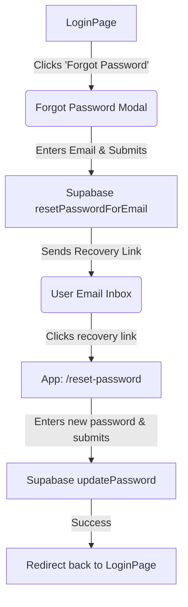

# Implementation Plan - Forgot Password Integration

This implementation plan details the addition of a seamless, highly polished "Forgot Password" capability and a "Reset Password" verification page, without impacting any of the existing working login or signup workflows.

---

## Proposed Solution

To maintain a smooth user experience, the **Forgot Password** flow will be implemented as an elegant, state-managed Modal directly on the `LoginPage` (avoiding separate page loads for a simple email request). The **Reset Password** flow will be handled by a dedicated, beautiful new page (`ResetPasswordPage`) that matches the aesthetic of our current login/signup screens, complete with micro-animations and form validation.

### Flowchart of Password Reset Flow

---

## User Review Required

Please review the proposed design of the forgot password modal and reset password page below:
1. **Password Length**: We will enforce a minimum length of 6 characters for the new password, consistent with the existing `SignupPage` constraints.
2. **Form Layout**: We place the "Forgot Password?" link right above or adjacent to the Sign In button for accessibility and visibility, matching modern auth layout patterns.

---

## Supabase Configuration Guide

To support the password recovery flow, you will need to perform a one-time configuration in your **Supabase Dashboard**:

1. **Add Redirect URL**:
   - Go to your **Supabase Dashboard** -> **Authentication** -> **URL Configuration**.
   - Under **Redirect URLs**, click **Add URL** and add:
     - `http://localhost:5173/reset-password` (for local development)
     - *(And your production domain landing page once deployed, e.g. `https://yourdomain.com/reset-password`)*
   - This ensures Supabase permits redirecting the user back to the password recovery page in your frontend app after clicking the link in their email.

2. **Verify Email Template (Optional)**:
   - Go to **Authentication** -> **Email Templates** -> **Reset Password**.
   - By default, Supabase email templates already use the correct variables (`{{ .ConfirmationURL }}`). Ensure this is not customized in a way that overrides the frontend-specified redirect parameter.

---

## Proposed Changes

### Auth Service Component

#### [MODIFY] [auth.js](file:///c:/Users/user/Desktop/CampusShop/CampusShop/src/services/auth.js)
Extend the existing auth service to support the reset and update password flows.
- Add `resetPassword(email)` to send the reset email with a redirect URL back to `/reset-password`.
- Add `updatePassword(newPassword)` to submit the new password to Supabase.

---

### Pages Component

#### [MODIFY] [LoginPage.jsx](file:///c:/Users/user/Desktop/CampusShop/CampusShop/src/pages/LoginPage.jsx)
Enhance the existing login page with the forgot password feature:
- Insert a clean, stylish "Forgot password?" link below the password input.
- Create an elegant, state-driven `Modal` overlaying the form to request the user's email.
- Execute a loading spinner on submission and handle errors gracefully (e.g., account not found or invalid email format) using Ant Design's `message` systems.

#### [NEW] [ResetPasswordPage.jsx](file:///c:/Users/user/Desktop/CampusShop/CampusShop/src/pages/ResetPasswordPage.jsx)
A brand new, premium-styled component that receives the user redirecting from the reset email link.
- Renders in the standard `.auth-page` layout with glassmorphic cards and subtle pulse animations.
- Provides a double-field form: **New Password** and **Confirm Password** with matched-input validation rules.
- Interacts with Supabase Auth to update the user record and redirects the user back to the login screen with a success state once done.

---

### Router Configuration

#### [MODIFY] [App.jsx](file:///c:/Users/user/Desktop/CampusShop/CampusShop/src/App.jsx)
Register the new page and ensure layout hygiene:
- Import `ResetPasswordPage` and map it to `<Route path="/reset-password" element={<ResetPasswordPage />} />`.
- Update navbar conditional rendering logic inside `AppContent` using `react-router-dom`'s `useLocation` hook to ensure the `Navbar` is NOT visible on `/reset-password`, preventing access to restricted sections during recovery.

---

## Verification Plan

### Manual Verification
1. **Forgot Password Link**: Verify clicking the "Forgot Password?" link on `/login` correctly displays the email entry modal.
2. **Modal Validation**: Test the email format validation rule (e.g. entering plain text prompts a warning).
3. **Trigger Reset**: Enter a valid email and click the send button. Verify the modal transitions into a success notification.
4. **Email Delivery**: Verify receiving the recovery email from Supabase containing the custom redirection link to `/reset-password`.
5. **Reset Form Matching**: Try typing different values in the "New Password" and "Confirm Password" fields to verify they trigger a matching error block.
6. **Submit Password Update**: Input matching valid passwords and click submit. Verify the loading state executes, the success notification is shown, and the router transitions back to `/login`.
7. **Clean Session Login**: Try signing in with the old password (should fail) and the new password (should succeed).
